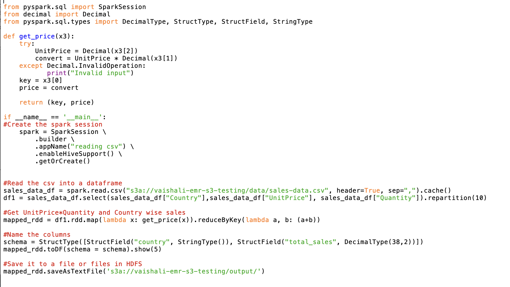
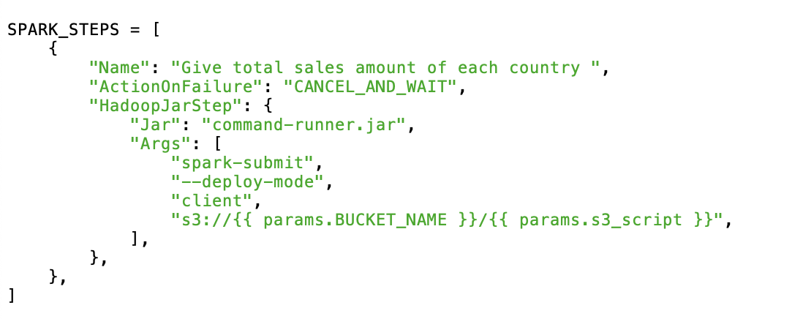

# [Airflow-EMR-Spark](https://github.com/vaishali-yasala/Airflow-EMR-Spark/blob/main/dags/airflow_spark_emr_job.py)
Using airflow upload data to s3 bucket and then create emr cluster, read data into hdfs from s3 as a step, submit a job as a step , wait for the step to finish and then terminate the emr cluster

## How it works

### Step One: Move data and Spark scripts to S3 Bucket
Initially, we create a DAG file using airflow, which uploads files from local to AWS S3 chosen bucket. These files include:
1. [sales-data.csv](https://raw.githubusercontent.com/vaishali-yasala/Airflow-EMR-Spark/main/dags/data/sales-data.csv) - this contains the data we are trying to analyze 
2. [main.py](https://github.com/vaishali-yasala/Airflow-EMR-Spark/blob/main/dags/scripts/main.py) - The script below is written in Python to analyze the sales data using Spark RDD transformations and actions.

This is main.py mentioned above which gets data from s3 and stores in HDFS and then runs the code to transform the data and give out the desired output. The desired output is sent HDFS and additional step is required to further move it S3 and be accesible from there. 

The simplest way to reduce the steps is to get data directly from S3 and move the resultant output to S3. 

Moving data 

### Step Two: Create an EMR cluster
Then, airflow creates an EMR cluster using <i>EmrCreateJobFlowOperator</i> operator. It creates a cluster and stores the EMR cluster id (unique identifier) in <i>  xcom </i>, which is a key value store used to access variables across Airflow tasks.Below we see the configurations defined to help in creating an EMR cluster.

- EMR_EC2_DefaultRole is the default managed role that is assigned to our EC2 instances as an instance profile when we create our cluster. The role has a default managed policy called "AmazonElasticMapReduceforEC2Role" which has a few risky actions.

- EMR_DefaultRole. Allows Amazon EMR to call other AWS services on your behalf when provisioning resources and performing service-level actions. This role is required for all clusters. 

### Step Three: Add steps
Add multiple steps to the EMR cluster created. These include:
1. <b> Move data from S3 to HDFS </b> - to copy sales data which was uploaded earlier to S3 bucket to EMR cluster HDFS. 
2. <b> Give total sales amount of each country</b> - This step runs the job with Spark application as step type on main.py file. It gives the total sales price from each country from the sales data. Output is stored in HDFS. 
3. <b> Move output data from HDFS to S3 </b> - this sends the output from HDFS to S3 chosen bucket folder output_data.

The above three steps can be reduced to one by accessing  the data directly from S3 and sending the resultant output to a folder in S3.

### Step Four: Terminate the EMR cluster
Once the three steps are successfully completed, airflow terminates the EMR cluster created earlier. 

## Result

The DAG below depicts the flow of Airflow, EMR and Spark association to process required data dynamically. The green outline indicates the success of this DAG.

Let us look at the output folder where the results files are stored in S3. part-00000 to part-00009 represents data from 10 partitions of data. 
 

This is the screenshot of data stored in partition 1.
